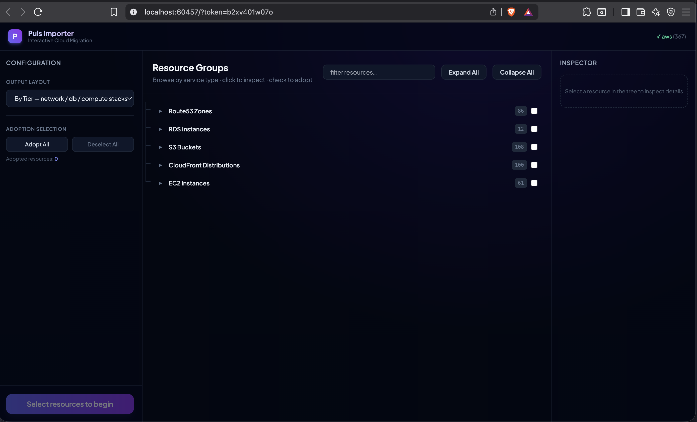

# Introducing Puls Importer: The Visual Interactive Cloud Migration Engine

Migrating legacy cloud infrastructure into modern Infrastructure-as-Code (IaC) is one of the most tedious, error-prone tasks in cloud engineering. Traditionally, developers had to manually inspect cloud consoles, copy resource IDs one by one, and write hundreds of lines of code from scratch.

To solve this, we are building **Puls Importer** - a visual, interactive cloud migration wizard that auto-discovers and maps cloud configurations directly into clean, modular TypeScript stacks.

<!-- more -->

!!! note
    **Status**: Currently in active development. Scheduled for official release in version **`1.0.0`**.

---

## The Vision: Why We Built Puls Importer

The goal of Puls is to make cloud infrastructure declarative, type-safe, and incredibly easy to manage. However, most companies aren't starting from scratch-they have hundreds of active virtual machines, load balancers, DNS records, and firewalls already running.

We built the Puls Importer to:

1. **Reduce Onboarding Friction**: Auto-discover existing resources across AWS, DigitalOcean, and Proxmox in seconds.
2. **Expose Dependency Relationships**: Visualize complex hierarchies (e.g., firewall rules connected to VMs, or CloudFront distributions mapped to S3 buckets and Route53 records) before adopting them.
3. **Generate Production-Ready Code**: Produce clean, nested stack structures instead of dumping all resources into a single giant file.

---

## How It Works

### 1. Ephemeral Local Server Scan
Running the command:

```bash
puls import
```
instantly starts a local secured HTTP server, loads your credentials from `.env` or config files, and automatically opens your web browser to the interactive dashboard.

### 2. High-Density Interactive Tree View
Puls scans your cloud provider and displays resources in a collapsible, hierarchical tree. Rather than showing a cluttered, floating nodes canvas, Puls Importer uses a structured connection tree designed specifically to fit standard laptop screens:



* **Cascading Selections**: Selecting any resource (such as a VM) automatically cascades and adopts all of its connected dependencies (such as its network firewall rules) underneath it.
* **Component Search Filter**: Instantly filter hundreds of cloud resources by name, type, or provider.
* **Property Inspector**: Inspect raw metadata, resource IDs, and custom name mappings in the sidebar.

### 3. Modular Stack Generation
Once you click **Adopt**, Puls partitions the resources by their transitive dependency tree roots and writes them to a clean folder structure inside your codebase. 

For example, adopting a compute group like `puls-web` generates a directory layout in your workspace under `infra/`:

```text
infra/
└── puls-web/
    ├── compute-stack.ts      # Droplets, EC2s, and VM instances
    └── network/
        └── network-stack.ts  # Firewalls, VPCs, and Subnets
```

### 4. Cross-Tier Code Linking
The generated TypeScript builders are fully linked across stack files. For example, your database or compute files will automatically reference and import sibling network configurations:

```typescript
// infra/puls-web/compute-stack.ts
import { Stack, Deploy } from "@puls-dev/core";
import { NetworkStack } from "./network/network-stack.js";

@Deploy({ dryRun: true })
export class ComputeStack extends Stack {
  network = Stack.from(NetworkStack);

  puls_web01 = DO.Droplet("puls-web01")
    .adoptId("581807348");
}
```

While the network stack automatically attaches configurations to their targets:

```typescript
// infra/puls-web/network/network-stack.ts
import { Stack, Deploy } from "@puls-dev/core";

@Deploy({ dryRun: true })
export class NetworkStack extends Stack {
  allow_from_home = DO.Firewall("allow-from-home")
    .adoptId("2d0eaad0-5ea6-44c5-9e28-b3f95a3452f8")
    .attachTo("puls-web01"); // <-- Automatically linked across files!
}
```

---

## Launching in v1.0.0
Puls Importer is currently undergoing testing and integration with more cloud providers (including GCP and Azure). It will launch officially as a core feature in **version `1.0.0`**.

Stay tuned for more updates, and happy migrating!
