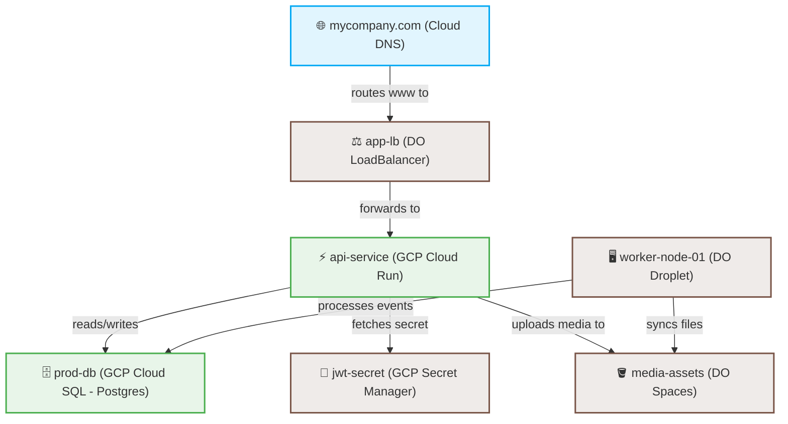

# 🌐 Infrastructure Blueprint: ProductionStack

> **Generated Automatically by Puls**  
> 🕒 *Last Updated:* 2026-05-28 19:04:12 UTC  
> 💻 *Deploy Status:* `Active (Healthy)`  
> 🏷️ *Environment:* `Production` | *Providers:* `GCP`, `DigitalOcean`

---

## 🗺️ System Topology

This diagram illustrates the resource relationships, traffic routing, and credentials bindings resolved at deploy time.

---

## 📊 Resource Inventory

A complete index of all active infrastructure managed under this stack.

| Resource Name | Provider | Resource Type | Specifications / Tier | Live Endpoint / IP | Est. Cost / Mo |
| :--- | :--- | :--- | :--- | :--- | :--- |
| **`api-service`** | `GCP` | `Cloud Run` | 1 CPU, 2Gi RAM (Min: 2, Max: 10) | `https://api-service-prod.run.app` | ~$30.00 |
| **`prod-db`** | `GCP` | `Cloud SQL` | PostgreSQL 16 (db-custom-2-7680) | `10.128.0.4` (Internal Only) | $76.80 |
| **`jwt-secret`** | `GCP` | `Secret Manager` | Standard Encrypted String | *Redacted / Secret* | $0.06 |
| **`dns-zone`** | `GCP` | `Cloud DNS` | Hosted Zone: `mycompany.com` | NS records deployed | $0.50 |
| **`worker-node-01`**| `DigitalOcean` | `Droplet (VM)` | s-2vcpu-4gb (Ubuntu 22.04 LTS) | `159.203.45.182` | $24.00 |
| **`media-assets`** | `DigitalOcean` | `Spaces` | S3-Compatible Object Store (250GB) | `media-assets.nyc3.digitaloceanspaces.com` | $5.00 |
| **`app-lb`** | `DigitalOcean` | `Load Balancer`| HTTP/HTTPS SSL Terminated | `159.203.88.90` | $12.00 |
| **Total** | | | | | **~$148.36 / Mo** |

---

## ⚙️ Detailed Specifications

### 🟢 Google Cloud Platform (GCP)

#### `GCP.CloudRun("api-service")`
* **Region**: `us-east1`
* **Concurrency**: `80` requests per instance
* **Autoscaling**: 2 minimum instances, 10 maximum instances
* **Public Access**: `Enabled` (IAM binding: `roles/run.invoker` granted to `allUsers`)
* **Environment Variables**:
  * `NODE_ENV`: `"production"`
  * `DATABASE_HOST`: `10.128.0.4` (Bound from `prod-db.endpoint`)
  * `JWT_SECRET`: `[SECRET: jwt-secret]` (Injected from Secret Manager)

#### `GCP.CloudSQL("prod-db")`
* **Region**: `us-east1`
* **Engine / Version**: `POSTGRES_16`
* **Hardware Profile**: 2 vCPUs, 7.68 GB RAM
* **Storage**: `50 GB` SSD (Auto-grow: `Enabled`)
* **Access Control**: Public IP `Disabled`, private VPC network only

---

### 🔵 DigitalOcean

#### `DO.Droplet("worker-node-01")`
* **Region**: `nyc3`
* **Size Slug**: `s-2vcpu-4gb`
* **VPC Networking**: Associated with `production-vpc`
* **SSH Fingerprints**: `root:ssh-ed25519 AAAAC3...`
* **📦 Universal Playbook Provisioning**:
  * **Status**: `Configured & Up-to-Date`
  * **Applied Playbooks**:
    | Playbook Name | Source Path | SHA-256 Hash | Status |
    | :--- | :--- | :--- | :--- |
    | `setup-docker` | `config/docker.yaml` | `a90b4d1c28c8ff2e...` | ✅ Applied |
    | `start-workers`| `config/workers.yaml` | `f3e5b618da4c2201...` | ✅ Applied |

#### `DO.Spaces("media-assets")`
* **Region**: `nyc3`
* **CORS Settings**: `GET` allowed from `https://*.mycompany.com`
* **Access Control (ACL)**: `private` (read-only requests require signature authorization)

---

## 🌐 DNS Record Table (`mycompany.com`)

| Record Name | Type | Target Value | TTL | Status |
| :--- | :--- | :--- | :--- | :--- |
| `@` | `A` | `159.203.88.90` (Bound to `app-lb`) | `300` | ✅ Active |
| `www` | `CNAME` | `mycompany.com.` | `3600` | ✅ Active |
| `media` | `CNAME` | `media-assets.nyc3.cdn.digitaloceanspaces.com.` | `3600` | ✅ Active |
| `@` | `TXT` | `"v=spf1 include:_spf.google.com ~all"` | `600` | ✅ Active |

---

> *Auto-generated blueprint by Puls Dev Suite. Do not edit manually. Commit this file to Git to audit changes.*
